<p align="center"></p>

# ArchitectAI

ArchitectAI is a TypeScript study CLI for the Claude Certified Architect exam; it uses the codebase itself as runnable examples for exam concepts.

## Quick start

```bash
git clone https://github.com/aviraldua93/architect-ai.git
cd architect-ai
npm install
npm run build
```

Run the local CLI through npm scripts:

```bash
npm run quiz       # quick practice quiz
npm run study      # adaptive study session
npm run assess     # exam readiness summary
npm run dashboard  # progress dashboard
npm run exam       # timed mock exam
```

After building, you can also run the compiled CLI directly:

```bash
node dist/cli/index.js help
node dist/cli/index.js quiz --domain 1
```

## Commands

| Command | Purpose |
| --- | --- |
| `quiz` | Practice questions, optionally filtered by domain or task statement. |
| `study` | Adaptive study flow using spaced repetition data. |
| `assess` | Exam readiness and per-domain scoring. |
| `dashboard` | Terminal progress dashboard. |
| `exam` | Mock exam flow with configurable question count. |
| `explain <concept>` | Placeholder for API-key-backed concept explanations. |

## Testing and quality checks

This repository uses npm for dependency management. The test script runs the Tier 1 suite with Bun, so Bun must be installed for `npm run test`.

```bash
npm run build
npm run typecheck
npm run test
npm run lint
```

Do not use the publish/pack lifecycle scripts for local validation; `prepublishOnly`, `prepack`, and `prepare` are package lifecycle hooks.

## Project layout

```text
src/agents/   Agent loop, orchestration, subagent, workflow, and hook examples
src/tools/    Tool definitions and structured error handling
src/mcp/      MCP server examples
src/prompts/  System prompts, few-shot examples, and output schemas
src/context/  Session state, progress tracking, and escalation helpers
src/cli/      CLI entry points for quiz, study, assess, dashboard, and exam
test/tier1/   Fast offline unit tests
web/          Separate Next.js web UI package
```

## Web UI

The web UI is a separate package under `web/`:

```bash
cd web
npm install
npm run dev
```

It starts on <http://localhost:3939>.

## Contributing

See [CONTRIBUTING.md](CONTRIBUTING.md) for branch, pull request, testing, and style guidance.

## License

MIT. See [LICENSE](LICENSE).